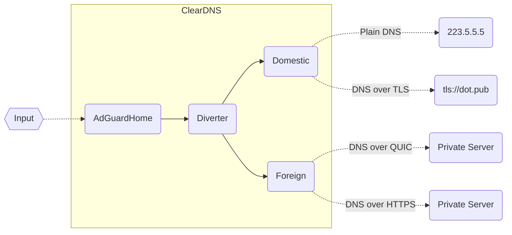

# ClearDNS

+ ✅ 无污染的 DNS 解析，避开运营商和防火长城的污染与劫持

+ ✅ 支持多种加密协议，包括 DoH 、DoT 、DoQ 与 DNSCrypt

+ ✅ DNS 请求审计，记录不同设备的查询、拦截、返回等信息

+ ✅ 自定义拦截规则，可屏蔽指定应用，如 QQ 、微信、微博等

+ ✅ 强制 hosts 功能，将指定域名直接解析到指定 IP 上

+ ✅ IPv6 支持，拦截特定的 DNS 请求类型，修改指定域名的 TTL

+ ✅ 在 DNS 层面上实现去广告与防跟踪功能，按需求配置自定义规则

由于 ClearDNS 工作在 DNS 层面，无论 APP 、网页还是机顶盒、IoT 设备等均可生效；它可以部署在内网中，为局域网设备提供服务，建议运行在内网一台长期开机的设备上（主路由、树莓派、小主机、旁路由、NAS 设备等），同时 ClearDNS 也可部署在公网服务器上，面向国内网络提供无污染服务。

## 设计架构

> AdGuardHome 用于加载拦截规则，可以自定义是否开启



DNS 请求在通过 AdGuardHome 处理后，发往分流器 Diverter ，在这里将借助路由资源、国内组 Domestic 与国外组 Foreign 的返回结果，甄别出被污染的数据，返回正确的 DNS 解析；两组请求都可拥有多个上游服务器，ClearDNS 可以逐个对服务器进行请求，亦可同时发起查询。

ClearDNS 支持多种 DNS 协议，首先是常规 DNS ，即基于 UDP 或 TCP 的明文查询，该方式无法抵抗 DNS 污染，对部分运营商有效，仅建议用于国内无劫持的环境下使用；其次为 `DNS over HTTPS` 、`DNS over TLS` 、`DNS over QUIC` 与 `DNSCrypt` ，它们都是加密的 DNS 服务协议，可以抵抗污染与劫持行为，但可能被防火长城拦截；在出境请求中，`DNS over TLS` 特别是标准端口的服务已经被大规模封杀，`DNSCrypt` 也基本无法使用，目前建议使用 `DNS over QUIC` 与非标准路径的 `DNS over HTTPS` 服务。

对于多种 DNS 加密协议的简述，可以参考[浅谈DNS协议](https://blog.dnomd343.top/dns-server/#DNS%E5%90%84%E5%8D%8F%E8%AE%AE%E7%AE%80%E4%BB%8B)，里面讲解了不同协议的区别与优缺点，以及服务器分享格式。

在分流器部分，ClearDNS 需要借助三个资源文件工作：

+ `gfwlist.txt` ：记录常见的被墙域名

+ `chinalist.txt` ：记录服务器在国内的常见域名

+ `china-ip.txt` ：记录国内 IP 段数据（CIDR 格式）

> 防火长城的 DNS 污染有一个特点，被污染的结果必为境外 IP 地址

当分流器接到请求时，若在 `chinalist.txt` 中有所匹配，则只请求国内组，若在 `gfwlist.txt` 匹配，则仅请求国外组；两者均未未匹配的情况下，将同时请求国内组与国外组，若国内组返回结果在 `china-ip.txt` 中，则证明 DNS 未被污染，采纳国内组结果，若返回国外 IP 地址，则可能已经被污染，将返回国外组结果。

由于以上资源数据一直在变动，ClearDNS 内置了更新功能，可自动这些资源文件；数据从多个上游项目收集，每天进行一次合并整理，整合数据的源码可见[此处](./assets/)，您可以自由配置更新服务器，或者禁用更新。

## 配置格式

ClearDNS 支持 JSON 、YAML 与 TOML 格式的配置文件，默认配置如下：

```yaml
port: 53

cache:
  enable: true
  size: 4194304
  optimistic: true

diverter:
  port: 5353

adguard:
  enable: true
  port: 80
  username: admin
  password: cleardns

domestic:
  port: 4053
  bootstrap: 223.5.5.5
  primary:
    - tls://dns.alidns.com
    - https://doh.pub/dns-query
  fallback:
    - 223.6.6.6
    - 119.29.29.29

foreign:
  port: 6053
  bootstrap: 8.8.8.8
  primary:
    - tls://dns.google
    - https://dns.cloudflare.com/dns-query
  fallback:
    - 1.1.1.1
    - 8.8.4.4

assets:
  cron: "0 4 * * *"
  update:
    gfwlist.txt: https://res.dnomd343.top/Share/cleardns/gfwlist.txt
    china-ip.txt: https://res.dnomd343.top/Share/cleardns/china-ip.txt
    chinalist.txt: https://res.dnomd343.top/Share/cleardns/chinalist.txt
```

### Port

DNS 服务端口，支持常规的 TCP 与 UDP 查询，默认为 `53` ；若您想开放 `DNS over TLS` 、`DNS over HTTPS` 等其他协议的服务，可以在 AdGuardHome 中进行具体配置。

### Cache

DNS 缓存配置，此处与 AdGuardHome 中的缓存不相关，建议打开其中一个即可。

```yaml
cache:
  size: 0
  enable: false
  optimistic: false
```

+ `enable` ：是否开启 DNS 缓存，默认为 `false`

+ `size` ：DNS 缓存容量，单位为字节，开启时建议设置在 `64k` 到 `4m` 量级，默认为 `0`

+ `optimistic` ：DNS 乐观缓存，开启后当数据 TTL 过期时，仍然返回原内容，但 TTL 修改为 10 ，同时立即向上游发起查询；由于绝大多数 DNS 记录在 TTL 期限内不会发生变化，这个机制可以显著减少请求平均延迟，但一旦出现变动，访问目标必须等待 10 秒后解析刷新才恢复正常。

### AdGuard

AdGuardHome 配置选项，此处选项将在每次重启后覆盖 AdGuardHome 的网页端配置。

```yaml
adguard:
  enable: true
  port: 80
  username: admin
  password: cleardns
```

+ `enable` ：是否开启 AdGuardHome 功能，默认为 `false`

+ `port` ：AdGuardHome 网页服务端口，默认为 `80`

+ `username` ：AdGuardHome 登录用户名，默认为 `admin`

+ `password` ：AdGuardHome 登录密码，默认为 `cleardns`

### Diverter

DNS 分流器选项，指定端口与分流规则

```yaml
diverter:
  port: 5353
  gfwlist: []
  china_ip: []
  chinalist: []
```

+ `port` ：DNS 分流器端口，若 AdGuardHome 未开启，本选项将失效，默认为 `5353`

> 以下选项用于添加自定义规则，将优先覆盖在资源文件上

+ `gfwlist` ：自定义的 GFW 拦截域名列表，针对该域名的查询将屏蔽 `domestic` 组结果

+ `chinalist` ：自定义的国内域名列表，针对该域名的查询将屏蔽 `foreign` 组结果

+ `china-ip` ：自定义的国内 IP 段，`domestic` 组返回内容若命中则采纳，否则使用 `foreign` 组结果

### Domestic

国内组 DNS 配置选项

```yaml
domestic:
  port: 4053
  verify: true
  parallel: true
  bootstrap: "..."
  primary:
    - ...
    - ...
  fallback:
    - ...
    - ...
```

+ `port` ：国内组 DNS 端口，默认为 `4053`

+ `verify` ：是否验证证书合法性，关闭后允许无效的 TLS 证书，默认为 `true`

+ `parallel` ：是否对多个上游进行并行查询，默认为 `true`

+ `bootstrap` ：引导 DNS 服务器，用于 `primary` 与 `fallback` 中 DNS 服务器域名的查询，必须为常规 DNS 服务 ，此处允许为字符串或字符串数组

+ `primary` ：主 DNS 列表，用于默认情况下的查询

+ `fallback` ：备用 DNS 服务器，当 `primary` 中 DNS 服务器无效时，回落到此处再次查询

### Foreign

国外组 DNS 配置选项

```yaml
foreign:
  port: 6053
  verify: true
  parallel: true
  bootstrap: "..."
  primary:
    - ...
    - ...
  fallback:
    - ...
    - ...
```

+ `port` ：国外组 DNS 端口，默认为 `6053`

> Foreign 选项意义与 Domestic 相同，可参考上文描述

### Reject

DNS 拒绝类型，指定屏蔽的 DNS 记录类型，不同 DNS 类型编号可参考 [Wiki](https://en.wikipedia.org/wiki/List_of_DNS_record_types) ，默认为空。

```yaml
reject:
  - 255
```

### Hosts

Hosts 记录，指定域名对应 IP 地址，支持正则匹配，默认为空。

```yaml
hosts:
  - "10.0.0.1 example.com$"
  - "..."
```

### TTL

配置特定域名的 ttl 时长，支持正则表达式匹配，默认为空。

```yaml
ttl:
  - "example.com$ 300"
  - "..."
```

### Custom

自定义脚本，在启动前执行

> 本功能用于注入自定义功能，基于 Alpine 的 ash 执行，可能不支持部分 bash 语法

```yaml
custom:
  - "..."
```

### Assets

分流资源升级配置，用于自动更新资源文件

```yaml
assets:
  disable: false
  cron: "0 4 * * *"
  update:
    gfwlist.txt: https://res.dnomd343.top/Share/cleardns/gfwlist.txt
    china-ip.txt: https://res.dnomd343.top/Share/cleardns/china-ip.txt
    chinalist.txt: https://res.dnomd343.top/Share/cleardns/chinalist.txt
```

+ `disable` ：是否关闭资源文件加载，默认为 `false`

+ `cron` ：指定触发升级的 Crontab 表达式

+ `url` ：指定资源升级的 URL 链接

## 部署教程

### 1. 网络配置

> 本项目基于 Docker 构建，在 [Docker Hub](https://hub.docker.com/repository/docker/dnomd343/cleardns) 或 [Github Package](https://github.com/dnomd343/ClearDNS/pkgs/container/cleardns) 可以查看已构建的各版本镜像。

ClearDNS 基于 Docker 网络有以下三种部署模式：

| | host 模式 | bridge 模式 | macvlan 模式 |
| :-: | :-: | :-: | :-: |
| 网络原理 | 宿主机网络 | 桥接网络 | 虚拟独立 mac 网卡 |
| 服务 IP | 宿主机 IP | 宿主机 IP | 容器独立 IP |
| 宿主机 IP | 静态 IP 地址 | 静态 IP 地址 | 静态/动态 IP 地址 |
| 宿主机网络 | 无需改动网络配置 | Docker 自动适配 | 手动修改底层网络配置 |
| 宿主机端口 | 占用宿主机 53, 80, 4053, 5353, 6053 端口 | 占用宿主机 53 与 80 端口 | 不占用端口 |
| 管理完整性 | 完全 | 无法区分客户端 | 完全 |
| 宿主机耦合 | 强耦合 | 一般耦合 | 链路层以上完全分离 |
| 网络性能 | 相对较高 | 相对较低 | 相对适中 |
| 部署难度 | 简单 | 简单 | 复杂 |

> 不熟悉 Linux 网络配置请勿使用 macvlan 模式，新手建议首选 host 模式。

以下操作均于 root 用户下执行

```bash
# 检查Docker环境
shell> docker --version
Docker version ···, build ···

# 无Docker环境请先执行安装
shell> wget -qO- https://get.docker.com/ | bash
```

ClearDNS 同时发布在多个镜像源上：

+ `Docker Hub` ：`dnomd343/cleardns`

+ `Github Package` ：`ghcr.io/dnomd343/cleardns`

+ `阿里云镜像` ：`registry.cn-shenzhen.aliyuncs.com/dnomd343/cleardns`

> 下述命令中，容器路径可替换为上述其他源，国内网络建议首选阿里云仓库

<details>

<summary><b>bridge 模式</b></summary>

<br/>

```bash
# 检查端口占用
shell> netstat -tlnpu | grep -E ":53|:80"
# 如果TCP/53或UDP/53已被占用，请先关闭对应进程
# 如果TCP/80端口被占用，可以关闭对应进程，也可使用其他端口
```

> 映射系统时间文件以同步容器时区，容器内默认为 UTC0 时区

```bash
# 运行ClearDNS容器
shell> docker run -dt \
  --restart always \
  --name cleardns --hostname cleardns \
  --volume /etc/cleardns/:/cleardns/ \
  --volume /etc/timezone:/etc/timezone:ro \
  --volume /etc/localtime:/etc/localtime:ro \
  --port 53:53/udp --port 53:53 --port 80:80 \
dnomd343/cleardns
```

</details>

<details>

<summary><b>host 模式</b></summary>

<br/>

```bash
# 检查端口占用
shell> netstat -tlnpu | grep -E ":53|:80|:4053|:5353|:6053"
# 如果UDP/53、UDP/4053、UDP/5353、UDP/6053、TCP/53、TCP/80、TCP/4053、TCP/5353、TCP/6053已被占用，请先关闭对应进程
```

> 映射系统时间文件以同步容器时区，容器内默认为 UTC0 时区

```bash
# 运行ClearDNS容器
docker run -dt --network host \
  --restart always \
  --name cleardns --hostname cleardns \
  --volume /etc/cleardns/:/cleardns/ \
  --volume /etc/timezone:/etc/timezone:ro \
  --volume /etc/localtime:/etc/localtime:ro \
  dnomd343/cleardns
```

</details>

<details>

<summary><b>macvlan 模式</b></summary>

<br/>

启动容器前需要创建 macvlan 网络

```bash
# 开启网卡混杂模式
shell> ip link set eth0 promisc on

# 创建macvlan网络，按实际情况指定网络信息
shell> docker network create -d macvlan \
  --subnet=192.168.2.0/24 \
  --gateway=192.168.2.1 \
  -o parent=eth0 macvlan
```

宿主机网络更改配置

```bash
# Debian系示例
shell> vim /etc/network/interfaces
```

添加以下内容，按实际情况指定网络信息

```ini
auto eth0
iface eth0 inet manual

auto macvlan
iface macvlan inet static
  address 192.168.2.34
  netmask 255.255.255.0
  gateway 192.168.2.2
  dns-nameservers 192.168.2.3
  pre-up ip link add macvlan link eth0 type macvlan mode bridge
  post-down ip link del macvlan link eth0 type macvlan mode bridge
```

```bash
# 重启宿主机
shell> reboot
```

> 映射系统时间文件以同步容器时区，容器内默认为 UTC0 时区

```bash
# 运行ClearDNS容器
shell> docker run -dt --network macvlan \
  --restart always --privileged \
  --name cleardns --host cleardns \
  --volume /etc/cleardns/:/cleardns/ \
  --volume /etc/timezone:/etc/timezone:ro \
  --volume /etc/localtime:/etc/localtime:ro \
  dnomd343/cleardns
```

编辑 macvlan 网络的 IP 地址，修改 ClearDNS 配置文件，指定容器的IP与网关，应按实际网络情况配置

```yaml
custom:
  - "ip addr flush dev eth0"
  - "ip addr add 192.168.2.3/24 dev eth0"
  - "ip route add default via 192.168.2.2"
```

```bash
# 重启容器生效
shell> docker restart cleardns
```

</details>

<hr/>

ClearDNS 会将数据持久化，以在重启 Docker 或宿主机后保留配置及日志

```bash
# 使用以下命令清除之前的ClearDNS配置及数据
shell> rm -rf /etc/cleardns
```

### 2. 修改配置文件

在 `cleardns.yml` 中指定上游 DNS 服务器，国内组可指定阿里 DNS 、DNSPod、114DNS 等国内公共 DNS 服务，国外组需要指定可用的加密 DNS 服务，建议自行搭建服务器，或使用共享的跨境服务器（例如 DH-DNS 与 LoopDNS 等）。

> DNSCrypt使用DNS Stamp封装，可以在[这里](https://dnscrypt.info/stamps)在线解析或生成链接内容。

各协议格式示例如下：

```
# Plain DNS
1.1.1.1
8.8.8.8

# DNS-over-TLS
tls://223.5.5.5
tls://dns.alidns.com

# DNS-over-HTTPS
https://dns.pub/dns-query
https://223.5.5.5/dns-query

# DNS-over-QUIC
quic://dns.adguard.com

# DNSCrypt
sdns://AQIAAAAAAAAAFDE3Ni4xMDMuMTMwLjEzMDo1NDQzINErR_JS3PLCu_iZEIbq95zkSV2LFsigxDIuUso_OQhzIjIuZG5zY3J5cHQuZGVmYXVsdC5uczEuYWRndWFyZC5jb20
```

修改配置文件后，重启 Docker 容器生效

```
shell> docker restart cleardns
```

### 3. 配置 AdGuardHome

浏览器打开 ClearDNS 服务，host 与 bridge 模式输入宿主机 IP 地址，macvlan 模式输入容器 IP，即可进入 AdGuardHome 配置界面，默认账号为 `admin` ，密码为 `cleardns`，可在配置文件中指定，登录后进入 AdGuardHome 管理界面。

进入 `设置` - `DNS设置`，建议启用 DNSSEC ，若配置文件中禁用了出口缓存，可在此处配置缓存选项，内存允许的情况下适当拉大缓存大小，并开启乐观缓存。

DNS封锁清单中，可配置以下规则：

+ `AdGuard`：`https://adguardteam.github.io/AdGuardSDNSFilter/Filters/filter.txt`

+ `Anti-AD`：`https://anti-ad.net/easylist.txt`

+ `AdAway`：`https://adaway.org/hosts.txt`

+ `乘风规则`：`https://res.343.re/Share/Adblock-Rules/xinggsf.txt`

> 配置过多的规则会导致设备负载变大，请酌情添加。

### 5. 配置 DHCP 信息

若您的服务部署在内网，为了使 ClearDNS 生效，需要在路由器 DHCP 服务中指定 DNS 服务器，host 与 bridge 模式指定为宿主机 IP ，macvlan 模式指定为容器 IP 即可。

> 对于内网中一些固定IP信息的设备，需要手动更改其DNS为上述IP地址。

## 手动编译

**本地构建**

```
shell> git clone https://github.com/dnomd343/ClearDNS.git
shell> cd ./ClearDNS/
shell> docker build -t cleardns .
```

**交叉构建**

```
# 构建并推送至Docker Hub
shell> docker buildx build -t dnomd343/cleardns --platform="linux/amd64,linux/arm64,linux/386,linux/arm/v7" https://github.com/dnomd343/ClearDNS.git --push
```

## 许可证

MIT ©2022 [@dnomd343](https://github.com/dnomd343)
