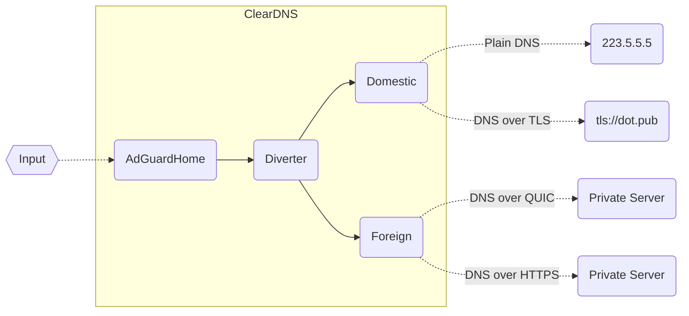

# ClearDNS

+ ✅ 无污染的 DNS 解析，避开运营商和防火长城的污染与劫持

+ ✅ 支持多种加密协议，包括 DoH 、DoT 、DoQ 与 DNSCrypt

+ ✅ 内置详细的分流规则，同时也支持自定义域名和 CIDR 策略

+ ✅ DNS 请求审计，记录不同设备的查询、拦截、返回等信息

+ ✅ 自定义拦截规则，可屏蔽指定应用，如 QQ 、微信、微博等

+ ✅ 强制 hosts 功能，将指定域名直接解析到指定 IP 上

+ ✅ IPv6 支持，拦截特定的 DNS 请求类型，修改指定域名的 TTL

+ ✅ 在 DNS 层面上实现去广告与防跟踪功能，按需求配置自定义规则

---

由于 ClearDNS 工作在服务器一侧，因此对 APP 、网页、机顶盒、IoT 设备等均可生效；它一般部署在内网中，为局域网设备提供服务，建议运行在内网一台长期开机的设备上（主路由、树莓派、小主机、旁路由、NAS 设备等），同时 ClearDNS 也可部署在公网服务器上，面向国内网络提供无污染服务。

## 设计架构

> AdGuardHome 用于加载拦截规则，可以自定义是否开启



DNS 请求在通过 AdGuardHome 处理后，发往分流器 Diverter ，在这里将借助路由资源、国内组 Domestic 与国外组 Foreign 的返回结果，甄别出被污染的数据，返回正确的 DNS 解析；两组请求都可拥有多个上游服务器，ClearDNS 可以逐个对服务器进行请求，亦可同时发起查询。

ClearDNS 支持多种 DNS 协议，首先是常规 DNS ，即基于 UDP 或 TCP 的明文查询，该方式无法抵抗 DNS 污染，对部分运营商有效（相当于不使用运营商分配的 DNS 服务器），仅建议用于国内无劫持的环境下使用；其次为 `DNS over HTTPS` 、`DNS over TLS` 、`DNS over QUIC` 与 `DNSCrypt` ，它们都是加密的 DNS 服务协议，可以抵抗污染与劫持行为，但可能被防火长城拦截；在出境请求中，`DNS over TLS` 特别是标准端口的服务已经被大规模封杀，`DNSCrypt` 也基本无法使用，目前建议使用 `DNS over QUIC` 与非标准路径的 `DNS over HTTPS` 服务。

对于多种 DNS 加密协议的简述，可以参考[浅谈DNS协议](https://blog.dnomd343.top/dns-server/#DNS%E5%90%84%E5%8D%8F%E8%AE%AE%E7%AE%80%E4%BB%8B)，里面讲解了不同协议的区别与优缺点，以及 DNS 服务的分享格式。

在分流器部分，ClearDNS 需要借助三个资源文件工作：

+ `gfwlist.txt` ：记录常见的被墙域名

+ `chinalist.txt` ：记录服务器在国内的常见域名

+ `china-ip.txt` ：记录国内 IP 段数据（CIDR 格式）

> 防火长城的 DNS 污染有一个特点，被污染的结果必为境外 IP 地址

当分流器接到请求时，若在 `chinalist.txt` 中有所匹配，则只请求国内组，若在 `gfwlist.txt` 中匹配，则仅请求国外组；两者均未未匹配的情况下，将同时请求国内组与国外组，若国内组返回结果在 `china-ip.txt` 中，则证明 DNS 未被污染，采纳国内组结果，若返回国外 IP 地址，则可能已经被污染，将选取国外组结果。

由于以上资源数据一直在变动，ClearDNS 内置了更新功能，用于自动获取新的资源文件；本项目提供了默认分流配置文件，从多个上游项目收集后合并，每天零点更新一次，数据处理的源码可见[此处](./assets)，下发地址如下：

+ `gfwlist.txt` ：`https://res.343.re/Share/cleardns/gfwlist.txt`

+ `china-ip.txt` ：`https://res.343.re/Share/cleardns/china-ip.txt`

+ `chinalist.txt` ：`https://res.343.re/Share/cleardns/chinalist.txt`

在 ClearDNS 的默认配置文件中，使用了本项目的分流资源作为更新上游，您可以修改配置，指向自定义资源（支持多个本地或远程文件），也可禁用更新。

## 配置格式

ClearDNS 支持 JSON 、YAML 与 TOML 格式的配置文件，默认配置如下：

```yaml
port: 53

cache:
  enable: true
  size: 4194304
  optimistic: true

diverter:
  port: 5353

adguard:
  enable: true
  port: 80
  username: admin
  password: cleardns

domestic:
  port: 4053
  bootstrap: 223.5.5.5
  primary:
    - tls://dns.alidns.com
    - https://doh.pub/dns-query
  fallback:
    - 223.6.6.6
    - 119.29.29.29

foreign:
  port: 6053
  bootstrap: 8.8.8.8
  primary:
    - tls://dns.google
    - https://dns.cloudflare.com/dns-query
  fallback:
    - 1.1.1.1
    - 8.8.4.4

assets:
  cron: "0 4 * * *"
  update:
    gfwlist.txt: https://res.dnomd343.top/Share/cleardns/gfwlist.txt
    china-ip.txt: https://res.dnomd343.top/Share/cleardns/china-ip.txt
    chinalist.txt: https://res.dnomd343.top/Share/cleardns/chinalist.txt
```

### Port

DNS 服务端口，支持常规的 TCP 与 UDP 查询，默认为 `53` ；若您想开放 `DNS over TLS` 、`DNS over HTTPS` 等其他协议的服务，可以在 AdGuardHome 中进行具体配置。

### Cache

DNS 缓存配置，此处与 AdGuardHome 中的缓存不相关，建议打开其中一个即可。

```yaml
cache:
  size: 0
  enable: false
  optimistic: false
```

+ `enable` ：是否开启 DNS 缓存，默认为 `false`

+ `size` ：DNS 缓存容量，单位为字节，开启时建议设置在 `64k` 到 `4m` 量级，默认为 `0`

+ `optimistic` ：DNS 乐观缓存，开启后当记录过期时，仍然返回上一次查询结果，但 TTL 修改为 10 ，同时立即向上游发起查询；由于绝大多数 DNS 记录在 TTL 期限内不会发生变化，这个机制可以显著减少请求平均延迟，但一旦出现变动，访问目标必须等待 10 秒后解析刷新才恢复正常。

### AdGuard

AdGuardHome 配置选项，此处选项将在每次重启后覆盖 AdGuardHome 的网页端配置。

```yaml
adguard:
  enable: true
  port: 80
  username: admin
  password: cleardns
```

+ `enable` ：是否开启 AdGuardHome 功能，默认为 `false`

+ `port` ：AdGuardHome 网页服务端口，默认为 `80`

+ `username` ：AdGuardHome 登录用户名，默认为 `admin`

+ `password` ：AdGuardHome 登录密码，默认为 `cleardns`

### Diverter

DNS 分流器选项，指定端口与分流规则

```yaml
diverter:
  port: 5353
  gfwlist: []
  china_ip: []
  chinalist: []
```

+ `port` ：DNS 分流器端口，若 AdGuardHome 关闭，本选项将失效，默认为 `5353`

> 以下选项用于添加自定义规则，将合并在资源文件上

+ `gfwlist` ：自定义的 GFW 拦截域名列表，针对该域名的查询将屏蔽 `domestic` 组结果，默认为空

+ `chinalist` ：自定义的国内域名列表，针对该域名的查询将屏蔽 `foreign` 组结果，默认为空

+ `china-ip` ：自定义的国内 IP 段，`domestic` 组返回内容若命中则采纳，否则使用 `foreign` 组结果，默认为空

### Domestic

国内组 DNS 配置选项

```yaml
domestic:
  port: 4053
  ipv6: true
  verify: true
  parallel: true
  bootstrap: ...
  primary:
    - ...
    - ...
  fallback:
    - ...
    - ...
```

+ `port` ：国内组 DNS 端口，默认为 `4053`

+ `ipv6` ：是否允许 IPv6 查询，关闭后将屏蔽 `AAAA` 请求，默认为 `true`

+ `verify` ：是否验证证书合法性，关闭后允许无效的 TLS 证书，默认为 `true`

+ `parallel` ：是否对多个上游进行并行查询，默认为 `true`

+ `bootstrap` ：引导 DNS 服务器，用于 `primary` 与 `fallback` 中服务器域名的查询，仅允许常规 DNS 服务，默认为空

+ `primary` ：主 DNS 服务器列表，用于默认情况下的查询

+ `fallback` ：备用 DNS 服务器列表，当 `primary` 中 DNS 服务器宕机时，回落到本处再次查询

### Foreign

国外组 DNS 配置选项

```yaml
foreign:
  port: 6053
  ipv6: true
  verify: true
  parallel: true
  bootstrap: ...
  primary:
    - ...
    - ...
  fallback:
    - ...
    - ...
```

+ `port` ：国外组 DNS 端口，默认为 `6053`

> Foreign 选项意义与 Domestic 中相同，可参考上文说明

### Reject

DNS 拒绝类型列表，指定屏蔽的 DNS 记录类型，不同 DNS 类型编号可参考[DNS记录类型](https://en.wikipedia.org/wiki/List_of_DNS_record_types)，默认为空。

```yaml
reject:
  - 255  # ANY
```

### Hosts

Hosts 记录列表，指定域名对应 IP 地址，支持正则匹配，默认为空。

```yaml
hosts:
  - "10.0.0.1 example.com$"
  - "..."
```

### TTL

域名过期时间列表，修改指定域名返回的 TTL 数值，支持正则表达式匹配，默认为空。

```yaml
ttl:
  - "example.com$ 300"
  - "..."
```

### Custom

自定义脚本，将在 ClearDNS 初始化后，即将启动前执行。

> 本功能用于注入自定义功能，基于 Alpine 的 `ash` 执行，可能不支持部分 `bash` 语法。

```yaml
custom:
  - "echo 'Hello World!'"
  - "..."
```

### Assets

资源文件升级选项，用于自动更新分流资源。

```yaml
assets:
  disable: false
  cron: "0 4 * * *"
  update:
    gfwlist.txt: https://res.dnomd343.top/Share/cleardns/gfwlist.txt
    china-ip.txt: https://res.dnomd343.top/Share/cleardns/china-ip.txt
    chinalist.txt:
      - https://res.dnomd343.top/Share/cleardns/chinalist.txt
      - /tmp/chinalist-local.txt
      - demo.list  # aka `${WorkDir}/assets/demo.list`
    custom.txt:
      - https://.../my-custom-asset.txt
```

+ `disable` ：是否关闭资源文件加载，默认为 `false`

+ `cron` ：指定触发升级的 Crontab 表达式

> 某一资源文件指定多个升级目标时，若其中任意一个出错，将导致该资源文件升级失败。

+ `update` ：指定资源升级的上游，支持远程 URL 和本地文件，支持指定多个目标，将自动去重后合并。

## 部署教程

### 1. 网络配置

> 本项目基于 Docker 构建，在 [Docker Hub](https://hub.docker.com/r/dnomd343/cleardns) 或 [Github Package](https://github.com/dnomd343/ClearDNS/pkgs/container/cleardns) 可以查看已构建的各版本镜像。

ClearDNS 基于 Docker 网络有以下三种部署模式：

> 如果您对以网络知识不熟悉，或只想开箱即用，使用 Bridge 模式即可。

|            |                Host 模式                 |       Bridge 模式        |     Macvlan 模式     |
|:----------:|:----------------------------------------:|:------------------------:|:--------------------:|
|  网络原理  |                宿主机网络                |         桥接网络         |  虚拟独立 mac 网卡   |
|  服务 IP   |                宿主机 IP                 |        宿主机 IP         |     容器独立 IP      |
| 宿主机 IP  |               静态 IP 地址               |       静态 IP 地址       |  静态/动态 IP 地址   |
| 宿主机网络 |             无需改动网络配置             |     Docker 自动适配      | 手动修改底层网络配置 |
| 宿主机端口 | 占用宿主机 53, 80, 4053, 5353, 6053 端口 | 占用宿主机 53 与 80 端口 |      不占用端口      |
| 管理完整性 |                   完全                   |      无法区分客户端      |         完全         |
| 宿主机耦合 |                  强耦合                  |         一般耦合         |  链路层以上完全分离  |
|  网络性能  |                 相对较高                 |         相对较低         |       相对适中       |
|  部署难度  |                   简单                   |           简单           |         复杂         |

> 不熟悉 Linux 网络配置请勿使用 Macvlan 模式，新手建议选择 Bridge 或 Host 模式。

以下操作均于 root 用户下执行

```bash
# 检查Docker环境
$ docker --version
··· Docker 版本信息 ···

# 无Docker环境请先执行安装
$ wget -qO- https://get.docker.com/ | bash
··· Docker 安装日志 ···
```

> 下述命令中，容器路径可替换为上述其他源，国内网络可优先选择阿里云仓库

ClearDNS 同时发布在多个镜像源上：

+ `Docker Hub` ：`dnomd343/cleardns`

+ `Github Package` ：`ghcr.io/dnomd343/cleardns`

+ `阿里云镜像` ：`registry.cn-shenzhen.aliyuncs.com/dnomd343/cleardns`

> 由于容器默认为 UTC-0 时区，将导致日志时间偏差 8 小时，映射 `/etc/timezone` 与 `/etc/localtime` 文件用于同步时区信息

<details>

<summary><b>Bridge 模式</b></summary>

<br/>

检查相关端口状态：

```bash
netstat -tlnpu | grep -E ":53|:80"
```

+ 若 `TCP/53` 或 `UDP/53` 被占用，请先关闭对应进程

+ 若 `TCP/80` 端口被占用，可以关闭对应进程，也可换用其他端口

启动 ClearDNS 容器：

```bash
docker run -dt \
  --restart always \
  --name cleardns --hostname cleardns \
  --volume /etc/cleardns/:/cleardns/ \
  --volume /etc/timezone:/etc/timezone:ro \
  --volume /etc/localtime:/etc/localtime:ro \
  -p 53:53/udp -p 53:53 -p 80:80 \
  dnomd343/cleardns
```

</details>

<details>

<summary><b>Host 模式</b></summary>

<br/>

检查相关端口状态：

```bash
netstat -tlnpu | grep -E ":53|:80|:4053|:5353|:6053"
```

+ 若 `TCP/53` 或 `UDP/53` 被占用，请先关闭对应进程

+ 若 `TCP/80` 端口被占用，可以关闭对应进程，也可换用其他端口

+ 若 `TCP/4053` 、`UDP/4053` 、`TCP/6053` 、`UDP/6053` 、`TCP/5353` 、`UDP/5353` 被占用，请先关闭对应进程或换用其他空闲端口

启动 ClearDNS 容器：

```bash
docker run -dt --network host \
  --restart always \
  --name cleardns --hostname cleardns \
  --volume /etc/cleardns/:/cleardns/ \
  --volume /etc/timezone:/etc/timezone:ro \
  --volume /etc/localtime:/etc/localtime:ro \
  dnomd343/cleardns
```

</details>

<details>

<summary><b>Macvlan 模式</b></summary>

<br/>

启动容器前需要创建 `macvlan` 网络，以下选项需按实际网络配置：

```bash
# 开启eth0网卡混杂模式
$ ip link set eth0 promisc on

# 创建macvlan网络，按实际情况指定网络信息
$ docker network create -d macvlan \
  --subnet={IPv4网段} --gateway={IPv4网关} \
  --subnet={IPv6网段} --gateway={IPv6网关} \  # IPv6可选
  --ipv6 -o parent=eth0 macvlan  # 在eth0网卡上运行
```

启动 ClearDNS 容器：

```bash
docker run -dt --network macvlan \
  --restart always --privileged \
  --name cleardns --host cleardns \
  --volume /etc/cleardns/:/cleardns/ \
  --volume /etc/timezone:/etc/timezone:ro \
  --volume /etc/localtime:/etc/localtime:ro \
  --ip {IPv4地址} --ip6 {IPv6地址} \
  dnomd343/cleardns
```

> 以下配置旨在让宿主机能够使用 ClearDNS ，若无此需求可以跳过

宿主机网络更改配置，以下示例基于 Debian 系发行版：

```bash
vim /etc/network/interfaces
```

添加以下内容，创建网桥连接宿主机，按实际情况指定网络信息：

> 以下配置文件仅用于示例，未执行 IPv6 配置

```ini
auto eth0
iface eth0 inet manual

auto macvlan
iface macvlan inet static
  address 192.168.2.34   # 宿主机静态IP地址
  netmask 255.255.255.0  # 子网掩码
  gateway 192.168.2.1    # 虚拟网关IP地址
  dns-nameservers 192.168.2.3  # DNS服务器
  pre-up ip link add macvlan link eth0 type macvlan mode bridge  # 宿主机网卡上创建网桥
  post-down ip link del macvlan link eth0 type macvlan mode bridge  # 退出时删除网桥
```

重启宿主机网络生效（或直接重启系统）：

```bash
$ /etc/init.d/networking restart
[ ok ] Restarting networking (via systemctl): networking.service.
```

</details>

---

ClearDNS 会将数据持久化存储，以在重启 Docker 或宿主机后保留配置及日志，上述命令将文件存储在工作目录 `/etc/cleardns` 下，您可以根据需要更改此目录。

如果需要恢复 ClearDNS 初始化配置，删除该目录并重启容器即可。

### 2. 修改配置文件

> 国外组服务器切勿使用常规 DNS 服务，例如 `8.8.8.8` ，由于请求信息为明文，GFW 会抢答回复数据，导致内容仍然受到污染。

在 `cleardns.yml` 中指定上游 DNS 服务器，国内组可指定国内公共 DNS 服务，国外组需指定可用的加密 DNS 服务，具体说明参考[关于上游的配置](#关于上游的配置)部分。

> DNSCrypt 使用 `DNS Stamp` 封装，可以在[这里](https://dnscrypt.info/stamps)在线解析或生成链接内容。

各 DNS 协议格式示例如下：

#### Plain DNS

+ `1.1.1.1`

+ `8.8.8.8`

#### DNS-over-TLS

+ `tls://223.5.5.5`

+ `tls://dns.alidns.com`

#### DNS-over-HTTPS

+ `https://dns.pub/dns-query`

+ `https://223.5.5.5/dns-query`

#### DNS-over-QUIC

+ `quic://94.140.14.14`

+ `quic://dns.adguard.com`

#### DNSCrypt

+ `sdns://AQIAAAAAAAAAFDE3Ni4xMDMuMTMwLjEzMDo1NDQzINErR_JS3PLCu_iZEIbq95zkSV2LFsigxDIuUso_OQhzIjIuZG5zY3J5cHQuZGVmYXVsdC5uczEuYWRndWFyZC5jb20`

修改配置文件后，重启 Docker 容器生效

```bash
docker restart cleardns
```

### 3. 配置 AdGuardHome

浏览器打开 ClearDNS 服务，使用 Host 或 Bridge 模式时输入宿主机 IP 地址，使用 Macvlan 模式时输入容器 IP ，即可进入 AdGuardHome 配置界面，默认登录账号为 `admin` ，密码为 `cleardns` ，该选项可在配置文件中修改，登录后进入 AdGuardHome 管理界面。

在 `设置` - `DNS设置` 中可以更改相关 DNS 选项，建议启用 DNSSEC ，若配置文件中禁用了出口缓存，可在此处配置缓存选项，内存允许的情况下适当拉大缓存大小，并开启乐观缓存，具体说明参考[关于缓存配置](#关于缓存的配置)部分。

在 DNS 封锁清单中，可配置以下规则：

+ `AdGuard` ：`https://adguardteam.github.io/AdGuardSDNSFilter/Filters/filter.txt`

+ `Anti-AD` ：`https://anti-ad.net/easylist.txt`

+ `AdAway` ：`https://adaway.org/hosts.txt`

+ `乘风规则` ：`https://res.343.re/Share/Adblock-Rules/xinggsf.txt`

> 配置过多的规则会导致设备负载变大，请酌情添加。

### 5. 配置 DHCP 信息

若您的服务部署在内网，为了使 ClearDNS 生效，需要在路由器 DHCP 服务中指定 DNS 服务器，使用 Host 与 Bridge 模式时，指定为宿主机 IP ，使用 Macvlan 模式指定为容器 IP ，设备重新接入网络后即可生效。

> 对于内网中一些固定 IP 的设备，需要手动更改其 DNS 为上述 IP 地址。

## 补充说明

### 关于上游的配置

ClearDNS 上游分为国内组 `Domestic` 与国外组 `Foreign` ，它们的配置逻辑不尽相同，下面分别说明：

国内组的目标在于避免劫持的前提下，尽量选择延迟低的上游服务器；我们可以选择运营商提供的 DNS 服务器，或者大公司搭建的公共 DNS 服务器（例如 AliDNS 、DNSPod 、114DNS 等），后者大部分都支持加密查询。

此前，一些公司会在不同运营商机房部署服务器，加快用户访问速度，在早期运营不完善时使用公共 DNS 服务器，时常会出现电信用户得到联通机房的解析，导致访问卡顿，而运营商分配的 DNS 一般就不存在这个问题，因此一些老教程会建议用户使用运营商解析。但是最近几年，基于访问来源来确定的解析已经成熟，大多数情况下不会出错，况且大公司的服务一般有多线 BGP 接入，已经基本摒弃基于 DNS 的线路分流机制。所以，使用运营商 DNS 服务仅在延迟上有一点优势（正常情况下延迟会低几毫秒），在确定不存在 DNS 污染行为后，您可以根据延迟实测结果确定是否使用。

如果运营商不存在 DNS 劫持行为，向公共 DNS 查询时，使用常规 DNS 与加密 DNS 并没有明显区别，理论上前者延迟会低一些，但几毫秒的差距在实际使用中基本可以忽略，您如果比较在意访问隐私性，建议使用加密链路，总体上利大于弊。

国外组的目标在于避开污染的前提下，选择更稳定与延迟更低的上游；鉴于目前绝大多数国外公共 DNS 加密服务已经被防火长城屏蔽，因此我们只能考虑自建服务器，或者使用共享的跨境服务器（例如 DH-DNS 、LoopDNS 、IQDNS 、Tex0n DNS 等公益项目）。

如果您有国外的服务器，可以考虑搭建一条线路自用，具体的教程可以参考[搭建全协议DNS服务器](https://blog.dnomd343.top/dns-server/)，截至目前，不建议开启 `DNS-over-TLS` 功能与标准路径的 `DNS-over-HTTPS` 服务，它们基本会被防火长城秒封，且可能波及整个服务器 IP ，更保险的做法是搭建非标准端口的 `DNS-over-QUIC` 服务，或者将 `DNS-over-HTTPS` 隐藏在博客、网盘等正常网页下面，提高存活性。

自建 DNS 服务器的延迟与跨境线路质量直接相关，普通的自建服务延迟可能偏高，而共享的 DNS 跨境服务器一般通过专线接入国内中转，且使用人数多时热缓存命中率高，延迟相对可以低不少，您可以同时配置两者作为国外组上游，提高整套系统的稳定性。

最后，上游服务器不建议配置过多，否则网络压力偏大的同时不会带来明显的提升，建议两组的 `primary` 与 `fallback` 均配置 2 ~ 3 台上游即可。

### 关于缓存的配置

在 ClearDNS 默认配置中打开了缓存选项，该选项作用于国内组与国外组的出口，而非 AdGuardHome 缓存，两者建议打开一个即可；正常情况下，更建议仅在 AdGuardHome 中配置缓存，避免多余的缓存，同时减少重复查询在分流器上带来的额外开销。

缓存大小上，一般配置 4MiB 到 16MiB 即可，若运行 ClearDNS 的机子运行内存较小，可以选择性减少；实际个人使用中，不需要过大体积的缓存，绝大部分在超过 TTL 后仍不会重复命中，反而降低了系统索引性能。

乐观缓存功能用于降低请求延迟，该选项打开后，即使请求的记录已经过期，仍然返回过期数据，但会把 TTL 降低为 10 秒，避免客户端系统长时间缓存该数据，同时向上游发起请求，覆盖过期数据；若实际上该 DNS 记录发生更新，网站访问将会出错，只能等待 10 秒后系统 DNS 记录过期重新请求，拿到正确的 DNS 数据，若 DNS 记录未变动，则正常访问网站。

从乐观缓存的工作原理看，就是在赌 DNS 数据未出现更新，正常情况下 DNS 记录在 TTL 内发生变动的概率很低，且大部分 DNS 记录的超时时间在 300s 左右，这种方式可以让 DNS 请求平均延迟显著降低，但缺点就是一旦变动就会带来十几秒的延迟，此时网络体验影响较大。

乐观缓存按需打开即可，正常情况下，打开后平均延迟能降低到 10ms 以内，命中错误的频率很低，个人认为还是相对值得的。

### DNS 延迟测试

您可以借助 [dnslookup](https://github.com/ameshkov/dnslookup) 工具进行测试，使用以下命令多次测试后取平均值，可以大致反映延迟时长。

```bash
$ time dnslookup baidu.com tls://dns.pub
··· DNS 查询返回 ···

real    0m0.030s
user    0m0.011s
sys     0m0.005s
```

## 手动编译

### 本地构建

```bash
$ git clone https://github.com/dnomd343/ClearDNS.git
$ cd ./ClearDNS/
$ docker build -t cleardns .
```

### 交叉构建

```bash
$ git clone https://github.com/dnomd343/ClearDNS.git
$ cd ./ClearDNS/
$ docker buildx build
    -t dnomd343/cleardns \
    -t ghcr.io/dnomd343/cleardns \
    -t registry.cn-shenzhen.aliyuncs.com/dnomd343/cleardns \
    --platform="linux/amd64,linux/arm64" . --push
```

## 许可证

> NOTE: AdGuardHome will work as a child process, which will not violate the GPLv3 license. ClearDNS is based on the MIT license, which allows commercial use, but the AdGuardHome function should be turned off at this time.

Thanks for [@AdguardTeam](https://github.com/AdguardTeam)'s [AdGuardHome](https://github.com/AdguardTeam/AdGuardHome.git) (GPL-3.0) project.

Thanks for [@ameshkov](https://github.com/ameshkov)'s [dnsproxy](https://github.com/AdguardTeam/dnsproxy.git) (Apache-2.0) project.

Thanks for [@shawn1m](https://github.com/shawn1m)'s [overture](https://github.com/shawn1m/overture.git) (MIT) project.

MIT ©2022 [@dnomd343](https://github.com/dnomd343)
